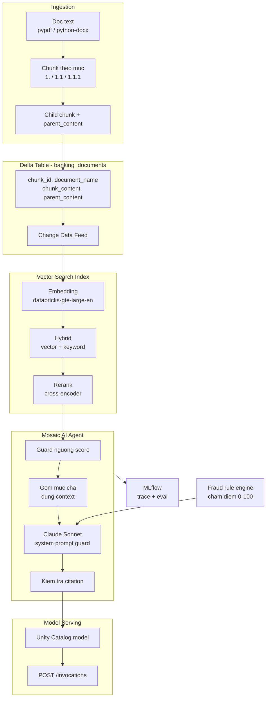

# Banking Knowledge Assistant - Architecture Diagram

```mermaid
flowchart TD
    subgraph ING[Ingestion]
        A1[Doc text<br/>pypdf / python-docx] --> A2[Chunk theo muc<br/>1. / 1.1 / 1.1.1]
        A2 --> A3[Child chunk + parent_content]
    end

    subgraph STO[Delta Table - banking_documents]
        B1[chunk_id, document_name<br/>chunk_content, parent_content]
        B2[Change Data Feed]
    end

    subgraph VS[Vector Search Index]
        C1[Embedding<br/>databricks-gte-large-en] --> C2[Hybrid<br/>vector + keyword]
        C2 --> C3[Rerank<br/>cross-encoder]
    end

    subgraph AGT[Mosaic AI Agent]
        D1[Guard nguong score] --> D2[Gom muc cha<br/>dung context]
        D2 --> D3[Claude Sonnet<br/>system prompt guard]
        D3 --> D4[Kiem tra citation]
    end

    subgraph SRV[Model Serving]
        E1[Unity Catalog model] --> E2[POST /invocations]
    end

    F[Fraud rule engine<br/>cham diem 0-100]
    G[MLflow<br/>trace + eval]

    A3 --> B1
    B1 --> B2
    B2 --> C1
    C3 --> D1
    D4 --> E1
    F --> D3
    AGT -.-> G
```
